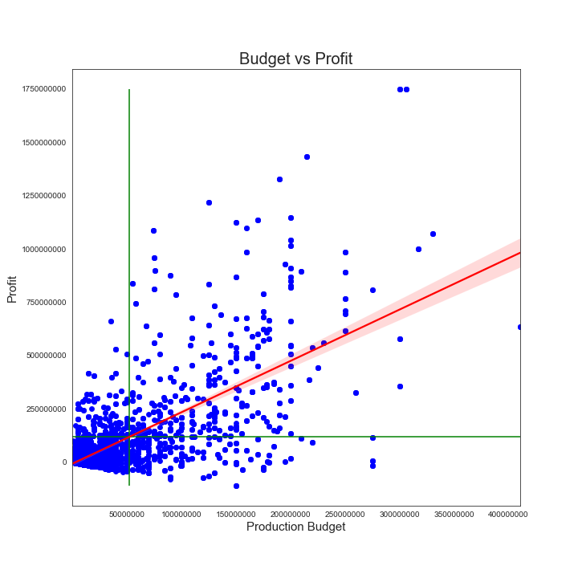
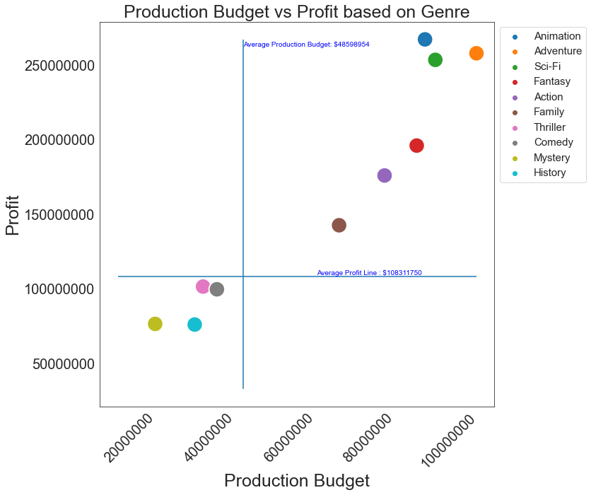
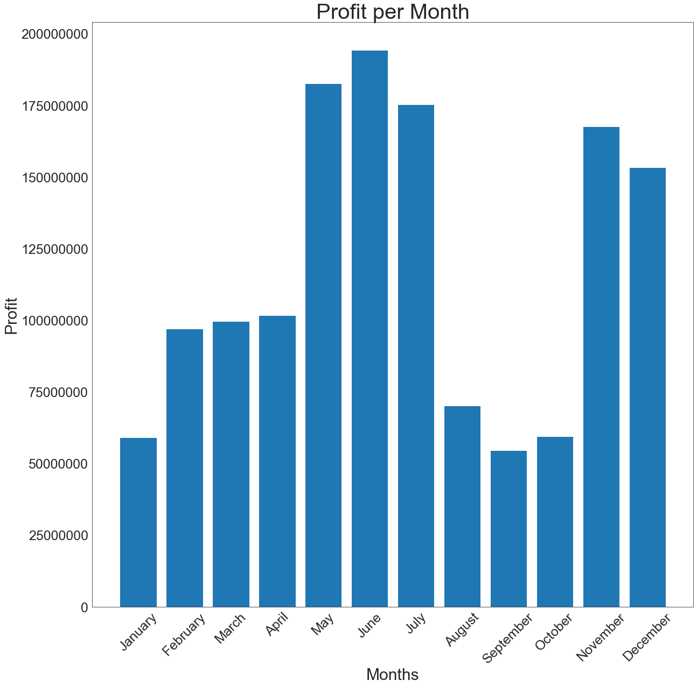
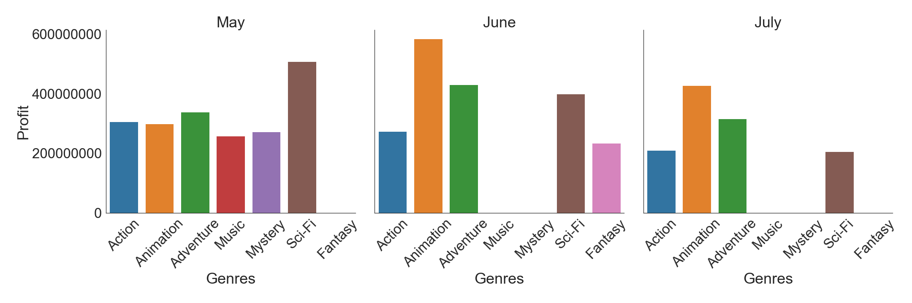
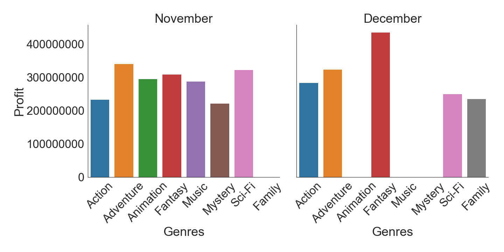
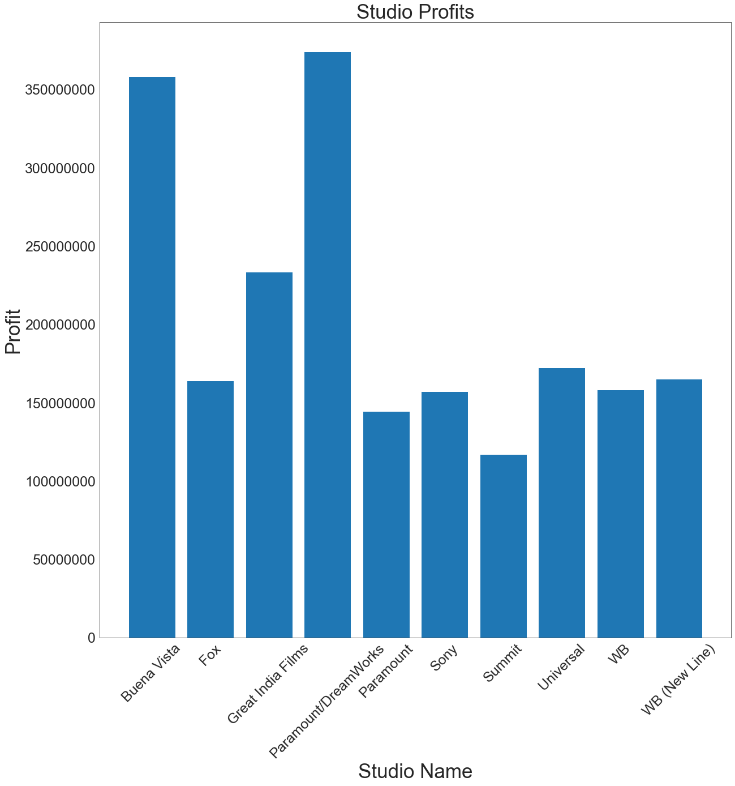
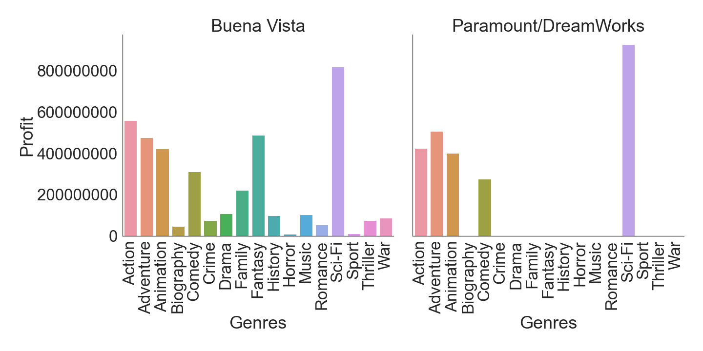

# Movie Genres Analysis
## Business Problem
Microsoft has expressed interest in entering the film industry by opening a brand new movie studio. Before opening the studio Microsoft have hired a team of data scientist to reccomend what type of films the studio should create to generate profitability. This analysis will focus on three questions relating to genres, month to month gross, and current studio gross.

1. Which movie genres will show the most profitability?
2. In which months do the consumers go out to buy movie tickets?
3. What genres of movies do the current studios release to bring them the best profits?

## Data
Data was retrieved from IMDB(Internet Movie Database), Box Office Mojo, and the Numbers
* IMDB provides data on genres, title, and release year
* The Numbers provided title, release year, world wide gross, and production budgets
* Box Office Mojo provided title, release year, and studio name
## Methodology
Fuzzy merged all three data bases on difflib.get_close_matches method on title and year released.  Used profits which was world wide gross subtracted by production budget to see how they were effected by the key points of production budget vs profit, month to month profits, and studio profits all broken out into genres.
## Analysis
### _Production Budget vs Profit Scatter Plot_

Graph shows that there is a weak positive correlation between production budget and profit.

When the graph is broken out into genres 6 of the most profitable genres on average had a large budget and were quite profitable.

### _Month over Month Profit Graph_

Graph shows the best months to release movies are during the Summer and Winter Holiday Seasons

When graph ins broken out into genres the best performing
genres were Action, Adventure, Animation, Sci-fi and Fantasy.

### _Studio Profits Graph_

Graph Shows the top 10 best performing Studios who's profit exceeded $200,000,000

Graph shows the most profitable genres for the two best performing studios.  The best peforming genres for those studios ended up being the best performing genres for the previous two key points.

## Conclusion

The analysis above shows that filming high budget movies in genres of Sci-Fi, Action, Adventure, Animation, Fantasy, or any of the combination of the aformentioned genres will return in a good profit.  When releasing these movies aim to release them during the summer during the month of May, June, July or the winter holiday season during the months of November or December because the time periods are peak moving going seasons.

## Future Ideas
 * Marketing/Advertising Budget
    * Marketing and advertisment are crucial points in calculation profitability and without out this data our resulting analysis may not be correct.
* Alternative Revenue Streams
    * Due to growing platforms such as Netflix, Hulu, Disney +, etc.. there are alternatives to releasing movies in theatres and because of the worldwide situations movies are being released worldwide on these platforms instead of in theatres.  Having information on the alternative revenue streams will help paint a clearer picture about the movie industry.  This doesn't even begin to include merchandising and advertisments in the movies.
* Grow a Fan Base
    * Building a rapport with movie goers helps grow a community that will return to the studio when the subsequent movie releases if they believe the studio on average release high quality movies.  Marvel as an example has built an entire cinematic universe with this technique.

#### contact info
Anhduy Nguyen [github](https://github.com/anguyen61191)